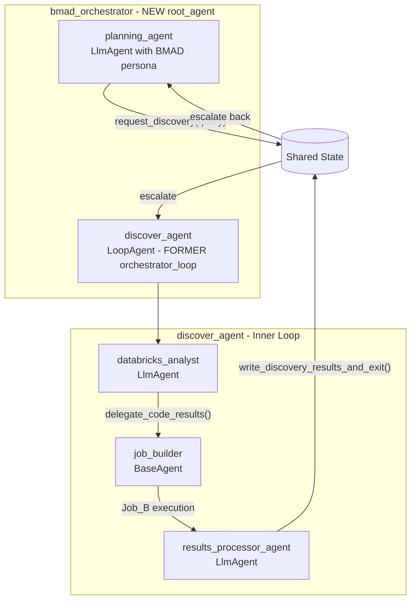
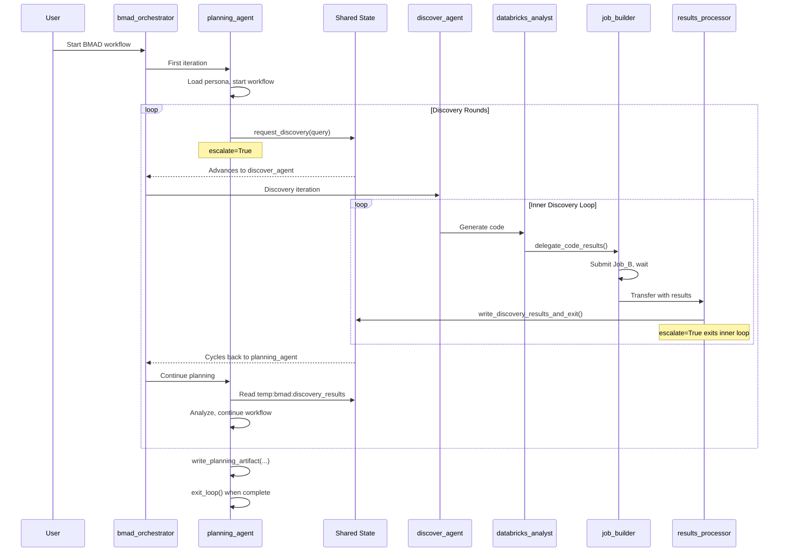

# BMAD LoopAgent Integration: Nested Discovery Architecture

## Overview

This plan reworks `databricks_rlm_agent/agent.py` so that:

1. **`orchestrator_loop`** (the current `root_agent`) becomes **`discover_agent`** — an inner LoopAgent sub-agent
2. **`bmad_orchestrator`** becomes the **new `root_agent`** — an outer LoopAgent that cycles between:

                                                - `planning_agent` (BMAD-driven planning with persona)
                                                - `discover_agent` (the former orchestrator_loop for code generation, job submission, and result processing)

This enables BMAD (Business Model Aligned Development) workflows where a planning agent can iteratively request discoveries (data exploration, code execution, UC queries) from the existing RLM machinery.

## Problem: Current Architecture is Flat

The current `orchestrator_loop` is the root agent:

```python
# Current agent.py (BEFORE)
root_agent = LoopAgent(
    name="orchestrator_loop",
    max_iterations=10,
    sub_agents=[
        databricks_analyst,       # 1. Generates code
        job_builder,              # 2. Submits Job_B
        results_processor_agent,  # 3. Processes results
    ]
)

app = App(name="adk_poc_plugins", root_agent=root_agent, ...)
```

This cannot be orchestrated by a higher-level planning agent without:

- Wrapping it in AgentTool (which isolates state)
- Manually coordinating between multiple agents

## Solution: Nested LoopAgent with Shared State



## Architecture

### Agent Hierarchy (AFTER)

```
bmad_orchestrator (LoopAgent) ← NEW root_agent
├── planning_agent (LlmAgent)
│   ├── BMAD persona loaded from _bmad/personas/
│   ├── Workflow tools: load_workflow_file, write_planning_artifact
│   ├── Discovery trigger: request_discovery()
│   └── Exit: exit_loop() when planning complete
│
└── discover_agent (LoopAgent) ← FORMER orchestrator_loop  
    ├── databricks_analyst (LlmAgent)
    │   └── Tools: delegate_code_results, metadata_keyword_search, etc.
    ├── job_builder (BaseAgent)
    │   └── Submits Job_B, waits for results
    └── results_processor_agent (LlmAgent)
        └── Processes results, calls write_discovery_results_and_exit()
```

### State Keys (temp:bmad:* namespace)

| Key | Direction | Purpose |

|-----|-----------|---------|

| `temp:bmad:discovery_query` | Planner → Discover | Discovery request from planning agent |

| `temp:bmad:discovery_context` | Planner → Discover | Additional context for the discovery task |

| `temp:bmad:discovery_results` | Discover → Planner | Structured discovery results |

| `temp:bmad:discovery_ready` | Discover → Planner | Signal that results are ready |

| `temp:bmad:planning_phase` | Planner | Track current planning phase |

| `temp:bmad:workflow_name` | App | Current BMAD workflow being executed |

### Component 1: discover_agent (Refactored orchestrator_loop)

Location: `databricks_rlm_agent/bmad/discover.py` or inlined in `agent.py`

The existing `orchestrator_loop` becomes a factory function:

```python
def create_discover_agent(
    model=None,
    max_iterations: int = 10,
) -> LoopAgent:
    """
    Create the discovery agent (formerly orchestrator_loop).
    
    This is the inner LoopAgent that handles:
    - Code generation (databricks_analyst)
    - Job submission (job_builder)
    - Result processing (results_processor_agent)
    
    Args:
        model: LLM model to use (defaults to build_agent_model())
        max_iterations: Max discovery iterations (default 10)
    
    Returns:
        LoopAgent configured for discovery workflow
    """
    model = model or build_agent_model()
    
    # databricks_analyst with updated tool set
    databricks_analyst = LlmAgent(
        name="databricks_analyst",
        model=model,
        instruction=get_discover_agent_instruction(),  # Updated instruction
        tools=[
            FunctionTool(save_artifact_to_volumes),
            FunctionTool(delegate_code_results),
            FunctionTool(repo_filename_search),
            FunctionTool(metadata_keyword_search),
            FunctionTool(get_repo_file),
            FunctionTool(write_discovery_results_and_exit),  # NEW: Signal completion
        ]
    )
    
    # job_builder unchanged
    job_builder = JobBuilderAgent(name="job_builder")
    
    # results_processor_agent with discovery output handling
    results_processor_agent = LlmAgent(
        name="results_processor",
        model=model,
        output_key="rlm:last_results_summary",
        instruction=RESULTS_PROCESSOR_INSTRUCTION,
    )
    
    return LoopAgent(
        name="discover_agent",  # Renamed from orchestrator_loop
        max_iterations=max_iterations,
        sub_agents=[
            databricks_analyst,
            job_builder,
            results_processor_agent,
        ]
    )
```

### Component 2: Discovery Tools (for discover_agent)

Location: `databricks_rlm_agent/bmad/tools.py`

```python
def write_discovery_results_and_exit(
    results: str,
    summary: str,
    tool_context: ToolContext
) -> dict:
    """
    Write discovery results to shared state and exit inner loop.
    
    Call this when discovery is complete to return control to planning_agent.
    
    Args:
        results: Structured discovery results (JSON or markdown)
        summary: Brief summary of what was discovered
        tool_context: ADK tool context for state access
    
    Returns:
        Status dictionary
    """
    tool_context.state["temp:bmad:discovery_results"] = results
    tool_context.state["temp:bmad:discovery_summary"] = summary
    tool_context.state["temp:bmad:discovery_ready"] = True
    tool_context.state["temp:bmad:discovery_query"] = None  # Clear query
    
    # Escalate exits the inner loop, returning to bmad_orchestrator
    tool_context.actions.escalate = True
    
    return {
        "status": "complete",
        "message": "Discovery results written, returning to planning agent"
    }
```

### Component 3: planning_agent (BmadPlanningAgent)

Location: `databricks_rlm_agent/bmad/planning.py`

```python
def create_planning_agent(
    catalog: BmadCatalog,
    persona_loader: BmadPersonaLoader,
    workflow_name: str,
    model=None,
) -> LlmAgent:
    """
    Create the BMAD planning agent.
    
    This agent:
    - Adopts a BMAD persona (Product Owner, Architect, etc.)
    - Follows a workflow loaded from _bmad/workflows/
    - Can request discoveries via request_discovery()
    - Produces planning artifacts (PRDs, user stories, etc.)
    
    Args:
        catalog: BmadCatalog for loading BMAD files
        persona_loader: Loader for persona markdown
        workflow_name: Name of workflow to execute (e.g., "product-owner")
        model: LLM model to use
    
    Returns:
        LlmAgent configured for BMAD planning
    """
    model = model or build_agent_model()
    persona_content = persona_loader.load_persona(workflow_name)
    
    return LlmAgent(
        name="planning_agent",
        model=model,
        instruction=f"""You are a BMAD agent executing the {workflow_name} workflow.

{persona_content}

## Discovery Capability

When you need to explore data, query Unity Catalog, or execute code:
1. Use request_discovery(query, context) to trigger the discovery agent
2. Wait for results in temp:bmad:discovery_results
3. Continue planning based on findings

## State Keys
- Read temp:bmad:discovery_ready to check if discovery completed
- Read temp:bmad:discovery_results for structured findings
- Read temp:bmad:discovery_summary for quick overview

## Workflow
Follow the loaded workflow file steps. Use write_planning_artifact() to produce outputs.
Call exit_loop() when the workflow is complete.
""",
        tools=[
            FunctionTool(request_discovery),
            FunctionTool(load_workflow_file),
            FunctionTool(write_planning_artifact),
            FunctionTool(exit_loop),
        ],
    )
```

### Component 4: Planning Tools (for planning_agent)

Location: `databricks_rlm_agent/bmad/tools.py`

```python
def request_discovery(
    query: str,
    context: str,
    tool_context: ToolContext
) -> dict:
    """
    Request discovery from the discover_agent.
    
    This writes the query to shared state and escalates to let
    bmad_orchestrator advance to discover_agent.
    
    Args:
        query: What to discover (e.g., "Find all tables related to vendors")
        context: Additional context for the discovery task
        tool_context: ADK tool context for state access
    
    Returns:
        Status dictionary
    """
    tool_context.state["temp:bmad:discovery_query"] = query
    tool_context.state["temp:bmad:discovery_context"] = context
    tool_context.state["temp:bmad:discovery_ready"] = False
    
    # Escalate advances the outer loop to discover_agent
    tool_context.actions.escalate = True
    
    return {
        "status": "requested",
        "query": query,
        "message": "Discovery requested, waiting for results"
    }


def load_workflow_file(
    workflow_path: str,
    tool_context: ToolContext
) -> dict:
    """Load a BMAD workflow file from _bmad/workflows/."""
    # Implementation reads from BmadCatalog
    ...


def write_planning_artifact(
    filename: str,
    content: str,
    artifact_type: str,
    tool_context: ToolContext
) -> dict:
    """Write a planning artifact (PRD, user story, etc.) to Volumes."""
    # Implementation writes to ADK_ARTIFACTS_PATH
    ...
```

### Component 5: bmad_orchestrator (NEW root_agent)

Location: `databricks_rlm_agent/bmad/agent.py`

```python
def create_bmad_orchestrator(
    catalog: BmadCatalog,
    persona_loader: BmadPersonaLoader,
    workflow_name: str,
    model=None,
    planning_max_iterations: int = 20,
    discovery_max_iterations: int = 10,
) -> LoopAgent:
    """
    Create the BMAD orchestrator as the root agent.
    
    This outer LoopAgent cycles between:
    1. planning_agent - BMAD persona-driven planning
    2. discover_agent - Data discovery, code execution, UC queries
    
    Args:
        catalog: BmadCatalog for loading BMAD files
        persona_loader: Loader for persona markdown
        workflow_name: Name of workflow to execute
        model: LLM model to use
        planning_max_iterations: Max planning loop iterations
        discovery_max_iterations: Max iterations for inner discover_agent
    
    Returns:
        LoopAgent configured as bmad_orchestrator
    """
    model = model or build_agent_model()
    
    # Create the planning agent with BMAD persona
    planning_agent = create_planning_agent(
        catalog=catalog,
        persona_loader=persona_loader,
        workflow_name=workflow_name,
        model=model,
    )
    
    # Create discover_agent (formerly orchestrator_loop)
    discover_agent = create_discover_agent(
        model=model,
        max_iterations=discovery_max_iterations,
    )
    
    return LoopAgent(
        name="bmad_orchestrator",
        max_iterations=planning_max_iterations,
        sub_agents=[
            planning_agent,   # 1. Plans, requests discoveries
            discover_agent,   # 2. Executes discoveries, returns results
        ]
    )
```

## Communication Flow



## File Structure

```
databricks_rlm_agent/
├── agent.py                    # UPDATED: App with bmad_orchestrator as root_agent
├── bmad/
│   ├── __init__.py
│   ├── catalog.py              # BmadCatalog - manifest parsing
│   ├── persona.py              # BmadPersonaLoader
│   ├── state_keys.py           # NEW: temp:bmad:* constants
│   ├── tools.py                # NEW: request_discovery, write_discovery_results_and_exit
│   ├── planning.py             # NEW: create_planning_agent() factory
│   ├── discover.py             # NEW: create_discover_agent() factory (former orchestrator_loop)
│   ├── agent.py                # NEW: create_bmad_orchestrator() factory
│   └── run.py                  # Entry point for BMAD workflows
├── agents/
│   └── job_builder.py          # JobBuilderAgent (unchanged)
├── plugins/
│   └── ...                     # Existing plugins (unchanged)
└── tools/
    └── ...                     # Existing tools (unchanged)
```

## Updated agent.py Structure

```python
# databricks_rlm_agent/agent.py (AFTER)

"""Agent definitions for Databricks RLM Agent.

Agent Hierarchy:
    bmad_orchestrator (LoopAgent) ← root_agent
      └── sub_agents:
            1. planning_agent (LlmAgent)    - BMAD persona-driven planning
            2. discover_agent (LoopAgent)   - Data discovery (formerly orchestrator_loop)
                 └── sub_agents:
                       1. databricks_analyst (LlmAgent)
                       2. job_builder (BaseAgent)
                       3. results_processor_agent (LlmAgent)
"""

from databricks_rlm_agent.bmad.agent import create_bmad_orchestrator
from databricks_rlm_agent.bmad.discover import create_discover_agent
from databricks_rlm_agent.bmad.planning import create_planning_agent
from databricks_rlm_agent.bmad.catalog import BmadCatalog
from databricks_rlm_agent.bmad.persona import BmadPersonaLoader

# ... existing imports and plugin setup ...

# =============================================================================
# Root Agent: BMAD Orchestrator
# =============================================================================

# Load BMAD configuration
_bmad_catalog = BmadCatalog(root_path=os.environ.get("ADK_BMAD_ROOT", "_bmad"))
_persona_loader = BmadPersonaLoader(_bmad_catalog)
_workflow_name = os.environ.get("ADK_BMAD_WORKFLOW", "product-owner")

# Create root agent as bmad_orchestrator
root_agent = create_bmad_orchestrator(
    catalog=_bmad_catalog,
    persona_loader=_persona_loader,
    workflow_name=_workflow_name,
    model=build_agent_model(),
    planning_max_iterations=int(os.environ.get("ADK_BMAD_MAX_ITERATIONS", "20")),
    discovery_max_iterations=int(os.environ.get("ADK_MAX_ITERATIONS", "10")),
)

# =============================================================================
# App Configuration
# =============================================================================

app = App(
    name="adk_bmad_orchestrator",
    root_agent=root_agent,
    plugins=[
        safety_plugin,
        formatting_plugin,
        linting_plugin,
        logging_plugin,
        global_instruction_plugin,
        context_injection_plugin,
    ]
)

# =============================================================================
# Backward Compatibility: Direct Discovery Mode
# =============================================================================

def get_discovery_only_app() -> App:
    """
    Create an App with only discover_agent as root (original behavior).
    
    Use this for non-BMAD workflows that don't need planning orchestration.
    Set ADK_MODE=discovery to use this in run.py.
    """
    discover_agent = create_discover_agent()
    return App(
        name="adk_discovery_only",
        root_agent=discover_agent,
        plugins=[...],
    )
```

## Key Differences from Original orchestrator_loop

| Aspect | orchestrator_loop (Before) | discover_agent (After) |

|--------|---------------------------|------------------------|

| Role | root_agent | sub_agent of bmad_orchestrator |

| Name | `orchestrator_loop` | `discover_agent` |

| Created by | Module-level initialization | `create_discover_agent()` factory |

| Exit behavior | `exit_loop()` ends session | `write_discovery_results_and_exit()` escalates to planner |

| State access | Owns the session | Shares state with planning_agent |

| Invocation | Direct from App | Called when planner escalates |

## Environment Variables

| Variable | Default | Purpose |

|----------|---------|---------|

| `ADK_BMAD_ROOT` | `_bmad` | Path to BMAD catalog root |

| `ADK_BMAD_WORKFLOW` | `product-owner` | BMAD workflow to execute |

| `ADK_BMAD_MAX_ITERATIONS` | `20` | Max iterations for outer bmad_orchestrator |

| `ADK_MAX_ITERATIONS` | `10` | Max iterations for inner discover_agent |

| `ADK_MODE` | `bmad` | Set to `discovery` for backward-compatible direct discovery |

## Implementation Order

1. **Phase 1: State Infrastructure**

                                                - [ ] Create `databricks_rlm_agent/bmad/state_keys.py` with constants
                                                - [ ] Test state sharing between nested LoopAgents

2. **Phase 2: Refactor orchestrator_loop**

                                                - [ ] Create `create_discover_agent()` factory in `bmad/discover.py`
                                                - [ ] Add `write_discovery_results_and_exit` tool
                                                - [ ] Update databricks_analyst instruction for discovery context

3. **Phase 3: Create Planning Agent**

                                                - [ ] Implement `BmadCatalog` and `BmadPersonaLoader`
                                                - [ ] Create `create_planning_agent()` factory
                                                - [ ] Implement `request_discovery` and other planning tools

4. **Phase 4: Wire Up Orchestrator**

                                                - [ ] Implement `create_bmad_orchestrator()` factory
                                                - [ ] Update `agent.py` to use bmad_orchestrator as root_agent
                                                - [ ] Add backward-compatible `get_discovery_only_app()`

5. **Phase 5: Testing**

                                                - [ ] Test nested loop escalation behavior
                                                - [ ] Test state communication between agents
                                                - [ ] Test full BMAD workflow end-to-end

## Dependencies

- No new external dependencies
- Reuses existing: `google-adk`, `pyyaml`
- New internal modules: `bmad/state_keys.py`, `bmad/discover.py`, `bmad/planning.py`, `bmad/agent.py`

## Risk Mitigation

1. **Backward Compatibility**: The `get_discovery_only_app()` factory preserves original behavior for non-BMAD use cases

2. **State Isolation**: All `temp:bmad:*` keys use a dedicated namespace to avoid conflicts with existing `temp:rlm:*` keys

3. **Iteration Limits**: Both inner and outer loops have configurable max_iterations to prevent runaway execution

4. **Incremental Migration**: Can be deployed alongside existing orchestrator_loop code until fully tested