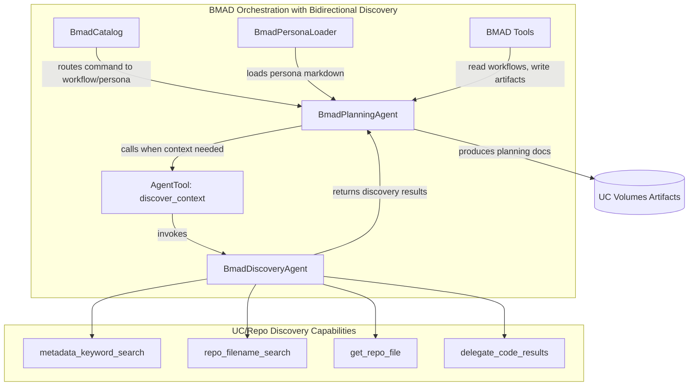
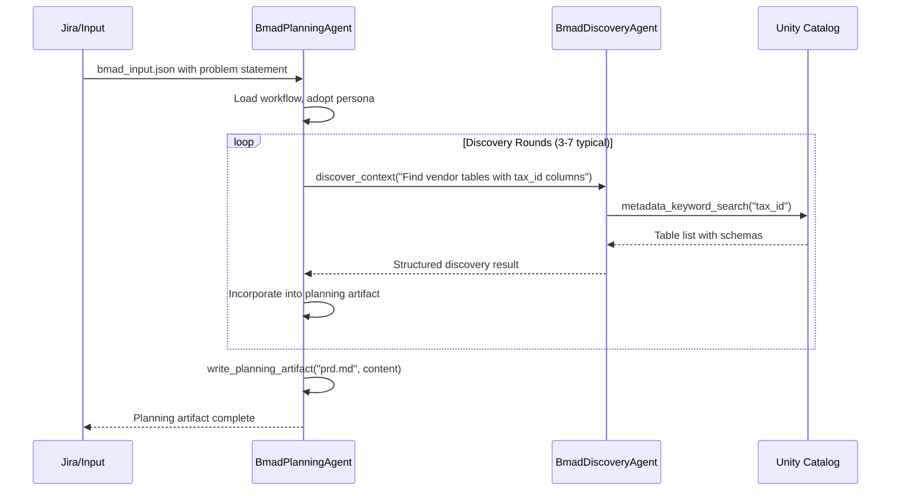
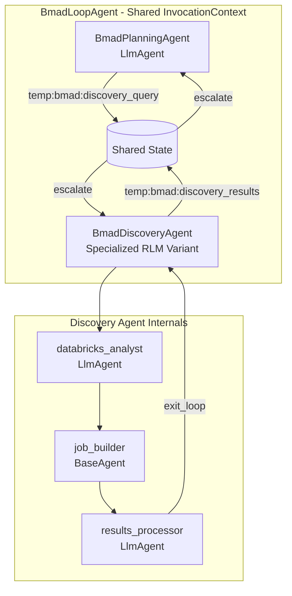

# BMAD Runner Integration Plan

## Overview

Add a BMAD orchestration capability to `databricks_rlm_agent/` that:

1. Parses the installed `_bmad/` content pack (manifests, personas, workflows)
2. Provides an ADK `LlmAgent` that dynamically adopts BMAD personas
3. Integrates with the existing RLM loop to consume discovery outputs and produce planning artifacts

## Architecture



### Interaction Flow (3-7 Discovery Rounds Expected)




## Key Design Decisions

### 1. Thin v0 Approach (Recommended)

- The LLM interprets workflow files directly (same as `.claude/commands/` behavior)
- No workflow state machine in Python - reduces complexity
- Persona is injected as system instruction from `_bmad/**/agents/*.md`

### 2. Input/Output Contract

- **Input**: `bmad_input.json` artifact written by `databricks_analyst` or `results_processor`
- **Output**: Planning artifacts written to `ADK_ARTIFACTS_PATH` (e.g., `prd.md`, `architecture.md`)

### 3. Bidirectional Communication via AgentTool

BMAD workflows are interactive - they need to request additional context mid-workflow. We use ADK's `AgentTool` pattern:

- **BmadDiscoveryAgent**: A lightweight LlmAgent with UC/repo discovery tools
- **AgentTool wrapper**: Exposes BmadDiscoveryAgent as a callable tool for BmadPlanningAgent
- **Iteration budget**: Expect 3-7 discovery rounds per workflow run

This approach:

- Keeps discovery logic encapsulated in a specialized agent
- Allows BmadPlanningAgent to focus on planning/persona while delegating technical discovery
- Uses ADK-native patterns (no custom state machine)

### 4. Standalone vs Integrated

- BMAD runner operates as a separate phase after initial RLM discovery
- Can be invoked via CLI or as part of an extended LoopAgent
- Discovery rounds happen within the BMAD session (not returning to the main RLM loop)

---

## Implementation Components

### Component 1: BmadCatalog (`databricks_rlm_agent/bmad/catalog.py`)

Parses `_bmad/_config/*.csv` manifests and provides routing:

```python
@dataclass
class WorkflowRoute:
    workflow_file: str      # e.g., "_bmad/bmm/workflows/2-plan-workflows/create-prd/workflow.md"
    agent_name: str         # e.g., "pm"
    output_location: str    # e.g., "planning_artifacts"
    outputs: str            # e.g., "prd"

class BmadCatalog:
    def __init__(self, bmad_dir: str):
        self._load_manifests(bmad_dir)
    
    def route_command(self, command: str) -> WorkflowRoute: ...
    def get_workflow(self, name: str) -> WorkflowRoute: ...
    def get_persona_path(self, agent_name: str) -> str: ...
    def resolve_output_path(self, output_location: str) -> str: ...
```

**Source files to parse**:

- `_bmad/_config/bmad-help.csv` (primary routing table)
- `_bmad/_config/agent-manifest.csv` (persona paths)
- `_bmad/_config/workflow-manifest.csv` (workflow registry)
- `_bmad/**/config.yaml` (output path variables)

### Component 2: BmadPersonaLoader (`databricks_rlm_agent/bmad/persona.py`)

Extracts system prompt from BMAD agent markdown files:

```python
@dataclass
class BmadPersona:
    name: str
    display_name: str
    title: str
    role: str
    identity: str
    communication_style: str
    principles: list[str]
    full_instruction: str  # Composed system prompt

class BmadPersonaLoader:
    def load_persona(self, persona_path: str) -> BmadPersona: ...
    def compose_instruction(self, persona: BmadPersona, workflow_context: str) -> str: ...
```

**Parsing strategy**:

- Extract YAML frontmatter from `_bmad/**/agents/*.md`
- Build instruction from: identity + role + communication_style + principles

### Component 3: BMAD Tools (`databricks_rlm_agent/bmad/tools.py`)

ADK function tools for the BMAD agent:

| Tool | Purpose |

|------|---------|

| `load_workflow_file(path)` | Read workflow/step markdown from `_bmad/` |

| `list_workflow_steps(workflow_path)` | List step files in a workflow directory |

| `write_planning_artifact(filename, content)` | Write output to artifacts path |

| `load_bmad_input()` | Read the input artifact from analyst |

| `list_planning_artifacts()` | Check existing artifacts for completion detection |

### Component 4: BmadDiscoveryAgent (`databricks_rlm_agent/bmad/discovery.py`)

A lightweight LlmAgent that handles UC/repo discovery requests from BmadPlanningAgent:

```python
from google.adk.agents import LlmAgent
from google.adk.tools import FunctionTool, AgentTool

# Import existing RLM discovery tools
from databricks_rlm_agent.tools import (
    metadata_keyword_search,
    repo_filename_search,
    get_repo_file,
    delegate_code_results,
)

DISCOVERY_INSTRUCTION = """You are a data discovery specialist for Unity Catalog and code repositories.

When asked to find information, use the available tools to:
1. Search UC metadata for tables/columns matching the request
2. Search repositories for relevant code, configs, or documentation
3. Download specific files when needed for detailed inspection
4. Execute exploratory queries via delegate_code_results when computation is needed

Return structured, concise results that directly answer the discovery request.
Focus on: table paths, column names, file paths, and key findings.
Do NOT generate planning artifacts - only return discovery results."""

def create_discovery_agent(model=None) -> LlmAgent:
    """Create the discovery agent with UC/repo tools."""
    from databricks_rlm_agent.modeling import build_agent_model
    
    return LlmAgent(
        name="bmad_discovery",
        model=model or build_agent_model(),
        instruction=DISCOVERY_INSTRUCTION,
        tools=[
            FunctionTool(metadata_keyword_search),
            FunctionTool(repo_filename_search),
            FunctionTool(get_repo_file),
            FunctionTool(delegate_code_results),
        ],
    )

def create_discovery_tool(discovery_agent: LlmAgent) -> AgentTool:
    """Wrap the discovery agent as a callable tool for BmadPlanningAgent."""
    return AgentTool(
        agent=discovery_agent,
        name="discover_context",
        description="""Request UC catalog or repository discovery.
        
Use this tool when you need to:
- Find tables containing specific columns or data types
- Locate code files, API specs, or configuration
- Explore schema structures or data relationships
- Run exploratory queries to understand data patterns

Provide a clear, specific discovery request describing what information you need.

Example requests:
- "Find all tables in silo_dev_rs containing vendor_tax_id columns"
- "Locate API specification files for the MVM vendor management system"
- "What columns are available in silo_dev_rs.sm_erp.dim_vendor?"
""",
    )
```

**Key design points**:

- Reuses existing RLM tools (no duplication)
- Focused instruction prevents discovery agent from "planning"
- AgentTool provides clean interface for BmadPlanningAgent

### Component 5: BmadPlanningAgent (`databricks_rlm_agent/bmad/agent.py`)

An ADK `LlmAgent` that adopts BMAD personas and has access to discovery:

```python
def create_bmad_agent(
    catalog: BmadCatalog,
    persona_loader: BmadPersonaLoader,
    workflow_name: str,
    discovery_agent: Optional[LlmAgent] = None,
    model: Optional[str] = None,
) -> LlmAgent:
    """Create an LlmAgent configured for a specific BMAD workflow.
    
    Args:
        catalog: BmadCatalog for routing and path resolution
        persona_loader: BmadPersonaLoader for persona extraction
        workflow_name: Name of the workflow to execute (e.g., "create-prd")
        discovery_agent: Optional pre-created discovery agent. If None, one is created.
        model: Optional model override
    
    Returns:
        LlmAgent configured with BMAD persona, workflow tools, and discovery capability
    """
    route = catalog.get_workflow(workflow_name)
    persona = persona_loader.load_persona(catalog.get_persona_path(route.agent_name))
    
    # Build instruction with persona + workflow context + discovery guidance
    instruction = persona_loader.compose_instruction(
        persona=persona,
        workflow_context=f"""Execute workflow: {route.workflow_file}

IMPORTANT: You have access to a `discover_context` tool that can search the Unity Catalog 
and code repositories when you need additional information. Use it when:
- The input context is missing details about data schemas or table structures
- You need to find relevant code, APIs, or configuration files
- You want to verify assumptions about the technical environment

Expect to make 3-7 discovery requests during a typical workflow run."""
    )
    
    # Create or use provided discovery agent
    if discovery_agent is None:
        from .discovery import create_discovery_agent
        discovery_agent = create_discovery_agent(model=model)
    
    # Wrap discovery agent as a tool
    from .discovery import create_discovery_tool
    discovery_tool = create_discovery_tool(discovery_agent)
    
    return LlmAgent(
        name=f"bmad_{route.agent_name}",
        model=model or build_agent_model(),
        instruction=instruction,
        tools=[
            # BMAD workflow tools
            FunctionTool(load_workflow_file),
            FunctionTool(list_workflow_steps),
            FunctionTool(write_planning_artifact),
            FunctionTool(load_bmad_input),
            FunctionTool(list_planning_artifacts),
            # Discovery capability via AgentTool
            discovery_tool,
        ],
    )
```

### Component 6: Integration Entry Point (`databricks_rlm_agent/bmad/run.py`)

CLI and programmatic interface:

```python
async def run_bmad_workflow(
    workflow: str,           # e.g., "quick-spec", "create-prd", "create-architecture"
    input_artifact: str,     # Path to bmad_input.json
    output_dir: Optional[str] = None,
    session_id: Optional[str] = None,
) -> BmadResult:
    """Run a BMAD workflow with the given input."""
```

---

## File Structure

```
databricks_rlm_agent/
├── bmad/
│   ├── __init__.py
│   ├── catalog.py          # BmadCatalog - manifest parsing and routing
│   ├── persona.py          # BmadPersonaLoader - persona extraction
│   ├── tools.py            # BMAD-specific ADK tools
│   ├── discovery.py        # BmadDiscoveryAgent + AgentTool wrapper
│   ├── agent.py            # BmadPlanningAgent factory (with discovery)
│   └── run.py              # Entry point and CLI
├── _bmad/                   # Existing installed content pack (unchanged)
└── ...
```

---

## Input/Output Artifacts

### Input: `bmad_input.json`

Written by `databricks_analyst` or manually, consumed by BMAD agent:

```json
{
  "goal": "create-prd",
  "problem_statement": "Build vendor enrichment pipeline for hospital data",
  "discovered_context": {
    "tables": ["silo_dev_rs.sm_erp.dim_vendor", "..."],
    "files": ["/Volumes/.../api_spec.yaml"],
    "constraints": ["HIPAA compliance", "real-time latency < 500ms"]
  },
  "prior_artifacts": ["product-brief.md"],
  "jira_ticket": "SPEN-1234"
}
```

### Output: Planning Artifacts

Written to `ADK_ARTIFACTS_PATH` (default: `/Volumes/silo_dev_rs/adk/artifacts`):

- `prd.md` - Product Requirements Document
- `architecture.md` - Technical Architecture
- `tech-spec.md` - Quick Spec for smaller tasks
- `epics-and-stories.md` - Implementation breakdown

---

## Integration with Existing RLM Loop

### Option A: Sequential Pipeline (Recommended for initial implementation)

1. RLM loop runs discovery phase (existing)
2. `databricks_analyst` writes `bmad_input.json` when planning is needed
3. Separate job/invocation runs BMAD workflow
4. BMAD outputs become input for implementation phase

### Option B: Extended LoopAgent (Future enhancement)

Add `BmadPlanningAgent` as a conditional sub-agent in the existing LoopAgent, triggered when `temp:rlm:needs_planning` is set.

---

## Discovery Round Management

### How Discovery Works Within BMAD Workflow

When BmadPlanningAgent calls `discover_context(request)`:

1. The AgentTool invokes BmadDiscoveryAgent with the request as input
2. BmadDiscoveryAgent uses its tools (metadata_keyword_search, repo_filename_search, etc.)
3. For simple lookups: immediate response via tool calls
4. For complex queries: delegate_code_results submits to executor job (same as RLM loop)
5. Results are returned to BmadPlanningAgent to incorporate into planning

### Handling delegate_code_results in Discovery

When BmadDiscoveryAgent needs to run exploratory Spark/SQL:

- **Local mode**: Uses LocalBackend for in-process execution
- **Databricks mode**: Submits to executor job via Jobs API (same as main RLM workflow)

This means discovery rounds with code execution have the same latency profile as the main RLM loop. For planning workflows, most discovery should be metadata/file lookups (fast), with occasional query execution.

### Session State Considerations

- BmadPlanningAgent and BmadDiscoveryAgent share the same session
- Discovery results are available via session state if needed for cross-round context
- Artifact service stores any downloaded files for later reference

---

## Testing Strategy

1. **Unit tests**: Catalog parsing, persona loading, path resolution
2. **Integration test**: Run `quick-spec` workflow with mock input
3. **E2E test**: Full pipeline from Jira ticket to planning artifact

---

## Dependencies

- No new external dependencies required
- Uses existing: `google-adk`, `pyyaml` (already in pyproject.toml)
- Standard library: `csv`, `pathlib`, `dataclasses`