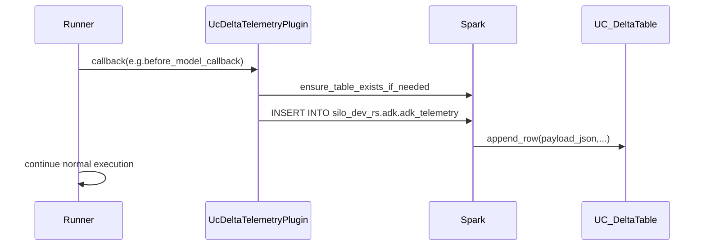

# Replace LoggingPlugin with UC Delta telemetry plugin

## Goal

- Replace `google.adk.plugins.logging_plugin.LoggingPlugin` with a **custom ADK plugin** that:
- preserves the same style of **stdout `print()` logs** for terminal observability, and
- also writes **agent callback telemetry** to a UC Delta table: `silo_dev_rs.adk.adk_telemetry`.
- Keep session persistence as-is via `databricks_rlm_agent/sessions/delta_session_service.py` (no extra session writes).

## What we learned from upstream ADK

- `LoggingPlugin` is a `BasePlugin` that logs at ADK callback points (user message, run start/end, per-event, per-agent, per-LLM call, per-tool call, plus errors) and only does `print()`.
- Source: `.venv` at `[...]/google/adk/plugins/logging_plugin.py`.
- The plugin callback context gives stable identifiers for joins:
- `invocation_context.invocation_id`, `invocation_context.session.id`, `invocation_context.user_id`, `invocation_context.app_name`, `invocation_context.agent.name`, and optional `invocation_context.branch`.
- `Event` has `id`, `author`, `timestamp`, `invocation_id`, and `content`/function call metadata.

## Proposed table (UC Delta) design

- Create table `silo_dev_rs.adk.adk_telemetry` (new table; different columns than job telemetry).
- **Core columns** (append-only):
- `telemetry_id STRING` (uuid)
- `ts TIMESTAMP` (UTC)
- `app_name STRING`
- `user_id STRING`
- `session_id STRING`
- `invocation_id STRING`
- `branch STRING`
- `agent_name STRING` (when available)
- `callback_name STRING` (e.g. `before_model_callback`)
- `event_id STRING` (when available)
- `tool_name STRING` + `function_call_id STRING` (tool callbacks)
- `model_name STRING` (model callbacks)
- `payload_json STRING` (full payloads: content, args/results, error info, usage metadata when present)
- `created_time TIMESTAMP`
- Partitioning suggestion: `PARTITIONED BY (app_name)` (and optionally `date(ts)` if you want later).

## Implementation approach

- Add a new plugin in-repo (so you can evolve it independent of `google_adk`):
- New file: [`databricks_rlm_agent/plugins/uc_delta_telemetry_plugin.py`](/home/rawleysm/dev/adk-generator/databricks_rlm_agent/plugins/uc_delta_telemetry_plugin.py)
- Class: `UcDeltaTelemetryPlugin(BasePlugin)` implementing the callback set you selected:
    - `on_user_message_callback`, `before_run_callback`, `after_run_callback`
    - `on_event_callback`
    - `before_agent_callback`, `after_agent_callback`
    - `before_model_callback`, `after_model_callback`, `on_model_error_callback`
    - `before_tool_callback`, `after_tool_callback`, `on_tool_error_callback`
- Preserve stdout behavior by mirroring upstream `LoggingPlugin` formatting (a `_log()` helper that calls `print()` and uses the same truncation/formatting approach), but also build a structured payload and persist it to UC.
- Implementation options: copy the formatting logic (message prefixes/truncation), or compose with an instance of ADK’s `LoggingPlugin` and forward the same callback inputs while doing UC inserts.
- Use Spark SQL `INSERT INTO` (same style as your existing `databricks_rlm_agent/telemetry.py`) to append rows.
- Add helper(s) to **ensure table exists** and to **append telemetry rows**.
- Serialize payloads with `json.dumps` (full payload mode) and escape single quotes for SQL.
- Wire the plugin into runner creation:
- Update [`databricks_rlm_agent/agent.py`](/home/rawleysm/dev/adk-generator/databricks_rlm_agent/agent.py):
    - Replace `get_logging_plugin()` usage with `get_telemetry_plugin()` (or similar), returning the UC plugin.
    - Keep `DebugLoggingPlugin` option if you want, but ensure it’s mutually exclusive with UC telemetry plugin only if that’s a requirement.
- Update [`databricks_rlm_agent/run.py`](/home/rawleysm/dev/adk-generator/databricks_rlm_agent/run.py) to pass the new plugin in `Runner(..., plugins=[...])`.
- Do **not** change `adk_generator/agent.py` (per requirement).

## Configuration & permissions

- Reuse existing env vars already used elsewhere:
- `ADK_DELTA_CATALOG` default `silo_dev_rs`
- `ADK_DELTA_SCHEMA` default `adk`
- Add env var to control the table name if you want flexibility:
- `ADK_AGENT_TELEMETRY_TABLE` default `adk_telemetry`
- Ensure the job’s cluster/service principal has UC permissions to `CREATE TABLE`/`INSERT` in `silo_dev_rs.adk`.

## Data flow (high-level)

## Validation steps

- Local/static: import the plugin and instantiate runner without errors.
- Databricks smoke test:
- Run orchestrator once (`databricks_rlm_agent/cli.py`) and verify rows appear in `silo_dev_rs.adk.adk_telemetry` for each callback.
- Ensure failures still log via `on_model_error_callback` / `on_tool_error_callback`.

## Files to touch

- Add: [`databricks_rlm_agent/plugins/uc_delta_telemetry_plugin.py`](/home/rawleysm/dev/adk-generator/databricks_rlm_agent/plugins/uc_delta_telemetry_plugin.py)
- Update wiring: