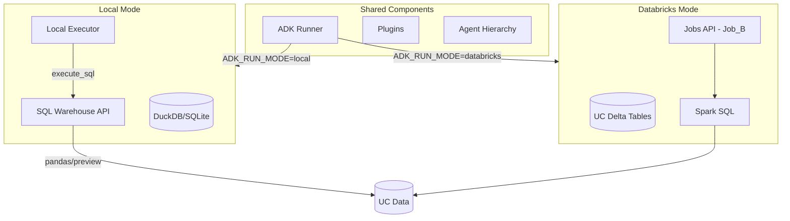

# Local Mode for databricks_rlm_agent

## Architecture Overview



## 1. Configuration and Mode Flag

**New environment variables:**

- `ADK_RUN_MODE=databricks|local` (default: `databricks`)
- `ADK_LOCAL_DB_PATH=.adk_local/adk.duckdb` (embedded database path)
- `ADK_LOCAL_ARTIFACTS_PATH=.adk_local/artifacts` (local artifact storage)
- `ADK_SQL_WAREHOUSE_ID` (required for local mode UC queries)
- `ADK_LOCAL_SYNC_TO_UC=0|1` (optional: enable sync after dev runs)

**Files to modify:**

- [databricks_rlm_agent/run.py](databricks_rlm_agent/run.py) - add mode detection and service selection

## 2. SQL Warehouse Query Function with Pandas Support

Create a new module `databricks_rlm_agent/sql_warehouse.py` that provides:

```python
def execute_sql(
    sql: str,
    *,
    as_pandas: bool = False,
    preview_rows: int = 20,
    catalog: str | None = None,
    schema: str | None = None,
    profile: str | None = None,
) -> SqlResult:
    """Execute SQL via Databricks SQL Warehouse.
    
    Returns:
        SqlResult with columns, rows (preview), df (if as_pandas), truncated flag
    """
```

**Implementation approach:**

- Small results (preview): `disposition=INLINE`, `format=JSON_ARRAY`, `row_limit=preview_rows`
- Large results (pandas): `disposition=EXTERNAL_LINKS`, `format=ARROW_STREAM`
  - Fetch chunks via presigned URLs (no auth header needed)
  - Concatenate Arrow streams into pandas DataFrame using `pyarrow`

**Reference:** Existing pattern in [scripts/execute_sql.py](scripts/execute_sql.py) lines 75-133

## 3. Local Session Service

Create `databricks_rlm_agent/sessions/local_session_service.py` implementing the same interface as [DeltaSessionService](databricks_rlm_agent/sessions/delta_session_service.py):

**Schema (DuckDB DDL matching UC Delta):**

```sql
-- sessions table
CREATE TABLE IF NOT EXISTS sessions (
    app_name VARCHAR NOT NULL,
    user_id VARCHAR NOT NULL,
    session_id VARCHAR NOT NULL,
    state_json VARCHAR,
    created_time TIMESTAMP NOT NULL,
    update_time TIMESTAMP NOT NULL,
    version BIGINT NOT NULL,
    is_deleted BOOLEAN NOT NULL,
    deleted_time TIMESTAMP,
    rewind_to_event_id VARCHAR,
    last_write_nonce VARCHAR,
    PRIMARY KEY (app_name, user_id, session_id)
);

-- events table  
CREATE TABLE IF NOT EXISTS events (
    app_name VARCHAR NOT NULL,
    user_id VARCHAR NOT NULL,
    session_id VARCHAR NOT NULL,
    event_id VARCHAR NOT NULL,
    invocation_id VARCHAR NOT NULL,
    author VARCHAR NOT NULL,
    event_timestamp TIMESTAMP NOT NULL,
    sequence_num BIGINT NOT NULL,
    event_data_json VARCHAR NOT NULL,
    state_delta_json VARCHAR,
    has_state_delta BOOLEAN NOT NULL,
    created_time TIMESTAMP NOT NULL,
    is_after_rewind BOOLEAN NOT NULL,
    PRIMARY KEY (app_name, user_id, session_id, event_id)
);

-- app_states, user_states tables (similar pattern)
```

**Key behaviors to preserve:**

- Ignore `temp:*` keys when persisting (ref: [delta_session_service.py](databricks_rlm_agent/sessions/delta_session_service.py) lines 43-61)
- Delete-on-`None` semantics for state deltas
- Idempotent event inserts via primary key

## 4. Local Telemetry Plugin

Create `databricks_rlm_agent/plugins/local_telemetry_plugin.py` with the same callback interface as [UcDeltaTelemetryPlugin](databricks_rlm_agent/plugins/uc_delta_telemetry_plugin.py):

- Same callback hooks (`before_model_callback`, `after_model_callback`, etc.)
- Insert into local `adk_telemetry` table instead of Spark DataFrame writes
- Preserve stdout logging behavior

**Local telemetry table schema:**

```sql
CREATE TABLE IF NOT EXISTS adk_telemetry (
    telemetry_id VARCHAR NOT NULL PRIMARY KEY,
    ts TIMESTAMP NOT NULL,
    app_name VARCHAR,
    user_id VARCHAR,
    session_id VARCHAR,
    invocation_id VARCHAR,
    branch VARCHAR,
    agent_name VARCHAR,
    callback_name VARCHAR NOT NULL,
    event_id VARCHAR,
    tool_name VARCHAR,
    function_call_id VARCHAR,
    model_name VARCHAR,
    tool_blocked BOOLEAN,
    blocked_reason VARCHAR,
    payload_json VARCHAR,
    created_time TIMESTAMP NOT NULL
);
```

## 5. Local Artifact Registry

Create `databricks_rlm_agent/artifact_registry_local.py` implementing the same interface as [ArtifactRegistry](databricks_rlm_agent/artifact_registry.py):

**Local artifact_registry table schema:**

```sql
CREATE TABLE IF NOT EXISTS artifact_registry (
    artifact_id VARCHAR NOT NULL PRIMARY KEY,
    session_id VARCHAR NOT NULL,
    invocation_id VARCHAR NOT NULL,
    iteration INTEGER NOT NULL,
    artifact_type VARCHAR NOT NULL,
    sublm_instruction VARCHAR,
    code_artifact_key VARCHAR,
    stdout_artifact_key VARCHAR,
    stderr_artifact_key VARCHAR,
    status VARCHAR NOT NULL,
    metadata_json VARCHAR,
    created_time TIMESTAMP NOT NULL,
    updated_time TIMESTAMP NOT NULL,
    consumed_time TIMESTAMP
);
```

## 6. Execution Backend Abstraction

Create `databricks_rlm_agent/execution_backend.py`:

```python
class ExecutionBackend(Protocol):
    def submit_and_wait(
        self,
        artifact_path: str,
        run_id: str,
        iteration: int,
        timeout_minutes: int,
        catalog: str,
        schema: str,
    ) -> dict[str, Any]: ...

class DatabricksBackend(ExecutionBackend):
    """Delegates to jobs_api.submit_and_wait()"""

class LocalBackend(ExecutionBackend):
    """Calls executor.execute_artifact() directly with execute_sql available"""
```

**Modify [JobBuilderAgent._submit_and_wait()](databricks_rlm_agent/agents/job_builder.py) (lines 694-720)** to use the backend abstraction instead of direct `jobs_api` import.

## 7. Runner Wiring Changes

Modify [run.py.create_runner()](databricks_rlm_agent/run.py) (lines 100-173):

```python
async def create_runner(...) -> tuple[Runner, SessionService]:
    run_mode = os.environ.get("ADK_RUN_MODE", "databricks")
    
    if run_mode == "local":
        from .sessions.local_session_service import LocalSessionService
        session_service = LocalSessionService(
            db_path=os.environ.get("ADK_LOCAL_DB_PATH", ".adk_local/adk.duckdb")
        )
        # Use LocalTelemetryPlugin
        logging_plugin = LocalTelemetryPlugin(...)
    else:
        # Existing DeltaSessionService path
        session_service = DeltaSessionService(spark=spark, ...)
        logging_plugin = get_telemetry_plugin()
    
    # Rest of runner setup...
```

## 8. Local Executor Globals

Modify [executor.execute_artifact()](databricks_rlm_agent/executor.py) (lines 112-122) to inject `execute_sql` when in local mode:

```python
exec_globals = {
    "__name__": "__main__",
    "__file__": artifact_path,
    "catalog": catalog,
    "schema": schema,
    "run_id": run_id,
    "iteration": iteration,
}

if run_mode == "local":
    from databricks_rlm_agent.sql_warehouse import execute_sql
    exec_globals["execute_sql"] = execute_sql
    # No spark in local mode
else:
    exec_globals["spark"] = spark
```

## 9. System Prompt Modification for Local Mode

Modify [agent.py](databricks_rlm_agent/agent.py) to append local-mode instructions when `ADK_RUN_MODE=local`:

```python
LOCAL_MODE_INSTRUCTION = """
**LOCAL MODE (SQL Warehouse queries, no PySpark):**
- Do NOT use `pyspark`, `SparkSession`, DataFrames, or `.collect()`.
- For data queries: use `execute_sql(sql_string, as_pandas=True)` for analysis
  or `execute_sql(sql_string, preview_rows=20)` for quick inspection.
- Use pandas operations locally after fetching data.
- You can still query all UC tables normally via SQL.
- For creating views: use standard SQL `CREATE VIEW ... AS ...`.
"""

# In GlobalInstructionPlugin setup:
if os.environ.get("ADK_RUN_MODE") == "local":
    GLOBAL_INSTRUCTIONS += LOCAL_MODE_INSTRUCTION
```

## 10. Optional: Sync Local State to UC

Create `databricks_rlm_agent/sync_to_uc.py` for post-development synchronization:

- Export local tables to Parquet/CSV
- Use SQL Warehouse API to `MERGE`/`INSERT` into UC Delta tables
- Namespace strategy: use distinct `app_name` prefix (e.g., `databricks_rlm_agent_local`) to avoid collisions

## File Summary

| New Files | Purpose |

|-----------|---------|

| `databricks_rlm_agent/sql_warehouse.py` | SQL Warehouse query function with pandas support |

| `databricks_rlm_agent/sessions/local_session_service.py` | Local embedded session persistence |

| `databricks_rlm_agent/plugins/local_telemetry_plugin.py` | Local telemetry persistence |

| `databricks_rlm_agent/artifact_registry_local.py` | Local artifact registry |

| `databricks_rlm_agent/execution_backend.py` | Abstraction for local vs Jobs API execution |

| `databricks_rlm_agent/sync_to_uc.py` | Optional sync utility |

| Modified Files | Changes |

|----------------|---------|

| `databricks_rlm_agent/run.py` | Mode detection, service selection |

| `databricks_rlm_agent/agent.py` | Plugin selection, prompt modification |

| `databricks_rlm_agent/agents/job_builder.py` | Use execution backend abstraction |

| `databricks_rlm_agent/executor.py` | Inject `execute_sql` in local mode |

| `databricks_rlm_agent/tools/delegate_code_results.py` | Use registry abstraction |

## Dependencies

Add to `pyproject.toml`:

- `duckdb>=0.9.0` (embedded SQL database)
- `pyarrow>=14.0.0` (Arrow stream parsing for pandas)
- `pandas>=2.0.0` (DataFrame support)