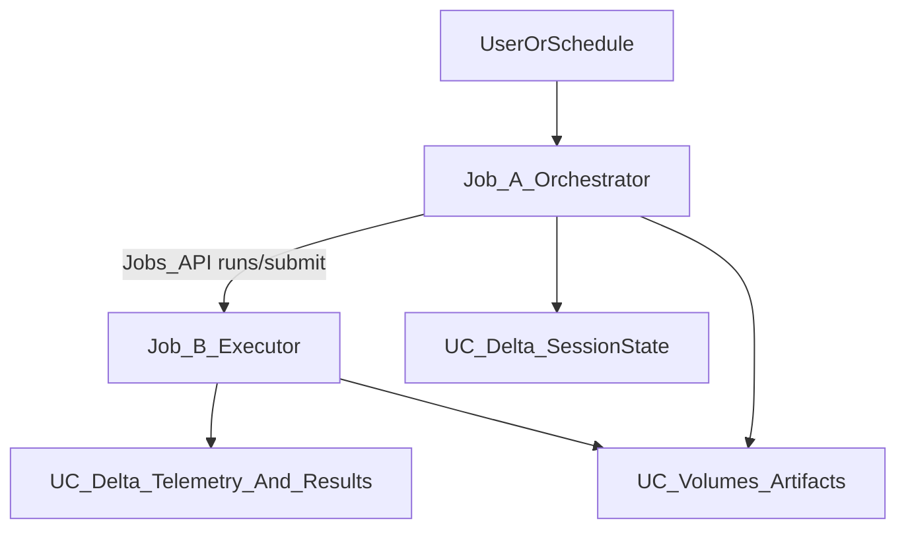

# Two-job Lakeflow deployment via DAB (existing cluster + cache-busting)

## What changed vs the previous plan

This plan explicitly implements the **two-job pattern** described in [`/home/rawleysm/dev/adk-generator/ai_docs/Databricks_RLM_Deployment.md`](/home/rawleysm/dev/adk-generator/ai_docs/Databricks_RLM_Deployment.md):

- **Job_A (Control Plane / Orchestrator)**: runs the RLM/ADK orchestration loop.
- **Job_B (Execution Plane / Executor)**: runs generated artifacts (script/notebook-style) and writes results.
- **Boundary**: Job_A calls the **Databricks Jobs API** (`runs/submit` or `run-now`) to trigger Job_B.

Because you cannot create clusters, **both jobs run on your existing cluster** via `existing_cluster_id`.

## Goals

- Deploy **two jobs** via **Databricks Asset Bundles**.
- Run on **existing cluster** `1115-120035-jyzgoasz` (no job clusters / serverless).
- Add a **local deploy script** that is:
- idempotent (safe to re-run)
- includes **cache-busting** (wheel version bump + artifact cleanup)
- ensures cluster is running (1-min poll × 10)
- ensures secret scope exists
- ensures both job IDs are created/resolved and stored in secrets

## Architecture (two-job)

### Job_A responsibilities

- Load secrets/config.
- Create/continue sessions in UC via `DeltaSessionService`.
- Generate an executable artifact into UC Volumes (recommended substrate: **Volumes-first Spark Python script**).
- Submit Job_B run via Jobs API with parameters pointing at the artifact path.
- Record submission metadata and high-level telemetry.

### Job_B responsibilities

- Read parameters (artifact path, run_id/iter, etc.).
- Execute the generated artifact.
- Write `result.json` to Volumes.
- Append a row to a new UC Delta table `{catalog}.{schema}.telemetry`.

## Cache/versioning: yes, plan for it

Given your history (and your prior working workflow), we should plan for:

- **Wheel version bump** before deploy (at least patch).
- **Cleanup** of `dist/`, `build/`, `*.egg-info`, `__pycache__` before building/deploying.
- Keep job resource keys stable so **job IDs stay stable** across redeploys (per your archived README).

This is especially important on **existing clusters** where libraries and Python import state can persist.

## Repository discoveries to reuse (from your prior successful scripts)

From `.obsolete/start_up_scripts/deploy_and_run.sh`:

- bump version in `pyproject.toml`
- clear caches/build artifacts
- `databricks bundle validate` then `databricks bundle deploy`
- resolve job id via a helper script
- optionally trigger a run and wait (with `uv run ...`)

From `.obsolete/start_up_scripts/README.md`:

- job IDs stay stable across deploys if you don’t change the job resource key/target

From `.obsolete/start_up_scripts/run_and_wait.py`:

- use `databricks-sdk` polling to block until completion and report logs

## Files to add/update

### DAB

- Add:
- [`/home/rawleysm/dev/adk-generator/databricks.yml`](/home/rawleysm/dev/adk-generator/databricks.yml)
- [`/home/rawleysm/dev/adk-generator/resources/rlm_orchestrator_job.yml`](/home/rawleysm/dev/adk-generator/resources/rlm_orchestrator_job.yml)
- [`/home/rawleysm/dev/adk-generator/resources/rlm_executor_job.yml`](/home/rawleysm/dev/adk-generator/resources/rlm_executor_job.yml)

### Code

- Package `databricks_rlm_agent` so it can run as wheel tasks:
- [`/home/rawleysm/dev/adk-generator/databricks_rlm_agent/pyproject.toml`](/home/rawleysm/dev/adk-generator/databricks_rlm_agent/pyproject.toml)
- add a console entrypoint module (e.g. `databricks_rlm_agent/cli.py`) for:
    - `rlm-orchestrator` (Job_A)
    - `rlm-executor` (Job_B)
- Add Jobs API client helpers (Job_A):
- `databricks_rlm_agent/jobs_api.py` with `submit_executor_run(executor_job_id, params) -> run_id, run_url`.
- **Auth plan (your choice)**: attempt **Databricks-native auth** first (run identity), and fall back to PAT env vars only if needed.
- Add executor harness (Job_B):
- `databricks_rlm_agent/executor.py` that loads and runs a Volumes-first artifact.
- Add telemetry table:
- `databricks_rlm_agent/telemetry.py` to `CREATE TABLE IF NOT EXISTS {catalog}.{schema}.telemetry (...)` and append rows.
- Parameterize hardcoded Volumes paths:
- update [`/home/rawleysm/dev/adk-generator/databricks_rlm_agent/agent.py`](/home/rawleysm/dev/adk-generator/databricks_rlm_agent/agent.py) to use env vars for `ARTIFACTS_PATH` and `AGENT_CODE_PATH`.

### Scripts

- Add:
- `scripts/deploy_rlm_two_job_bundle.sh` (deploy + idempotent secrets + store both job IDs)
- `scripts/get_bundle_job_id.sh` (restore missing helper referenced by older scripts)
- `scripts/run_and_wait.py` (adapted from obsolete, generic job runner)
- `.env.example` and `.gitignore` update

## Bundle design (two jobs)

### Job resource keys (keep stable)

- `rlm_orchestrator_job`
- `rlm_executor_job`

### Compute

- Both jobs set:
- `existing_cluster_id: ${var.cluster_id}`

### Task types

- **Job_A**: `python_wheel_task` calling `rlm-orchestrator`
- **Job_B**: `python_wheel_task` calling `rlm-executor`

### Parameters/env vars

- Pass config via env vars:
- `ADK_DELTA_CATALOG`, `ADK_DELTA_SCHEMA`
- `ADK_ARTIFACTS_PATH`, `ADK_AGENT_CODE_PATH`
- `ADK_EXECUTOR_JOB_ID` (Job_A needs to know Job_B’s ID)
- Secrets:
- `google-api-key` injected as `GOOGLE_API_KEY`.
- Optional fallback secrets for Jobs API (only if native auth fails): `databricks-host`, `databricks-token`.

## Secret scope keys (idempotent)

In a scope (default `adk-secrets`):

- `google-api-key` (required)
- `rlm-orchestrator-job-id` (set by deploy script)
- `rlm-executor-job-id` (set by deploy script)

## Local `.env` contract

- `DATABRICKS_PROFILE` (default `rstanhope`)
- `CLUSTER_ID=1115-120035-jyzgoasz`
- `SECRET_SCOPE=adk-secrets`
- `GOOGLE_API_KEY=...`
- `ADK_DELTA_CATALOG=...`
- `ADK_DELTA_SCHEMA=...`
- `ADK_ARTIFACTS_PATH=/Volumes/<catalog>/<schema>/<volume>/artifacts`
- `ADK_AGENT_CODE_PATH=/Volumes/<catalog>/<schema>/<volume>/agent_code/agent_code_raw.py`

## Deploy script flow (detailed)

`scripts/deploy_rlm_two_job_bundle.sh` will:

1. Load `.env`.
2. **Cluster check/start loop**: 10 minutes, check every 60 seconds.
3. **Bump wheel version** in the package used for the jobs (patch increment).
4. **Clear build caches**: `dist/ build/ *.egg-info __pycache__`.
5. `databricks bundle validate --profile ...`
6. `databricks bundle deploy --profile ...`
7. Resolve both job IDs:

- `scripts/get_bundle_job_id.sh rlm_orchestrator_job dev <profile>`
- `scripts/get_bundle_job_id.sh rlm_executor_job dev <profile>`

8. Ensure secret scope exists; ensure `google-api-key` exists.
9. Store `rlm-orchestrator-job-id` and `rlm-executor-job-id` into the secret scope if missing.
10. Optional: trigger Job_A and wait using `uv run scripts/run_and_wait.py --job-id <orchestrator_job_id>`.

## Validation

- After deploy, verify:
- Job IDs remain stable across redeploys.
- Job_A can submit Job_B.
- UC tables exist: `{catalog}.{schema}.sessions/events/app_states/user_states` + new `{catalog}.{schema}.telemetry`.
- Artifacts and `result.json` appear in the target Volume path.