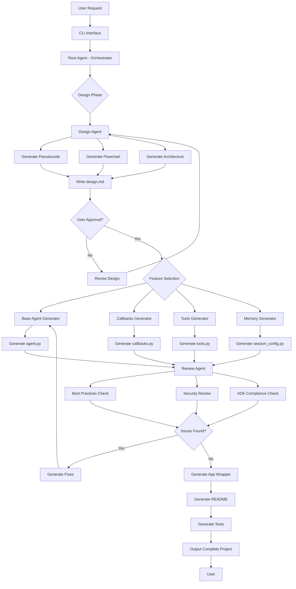
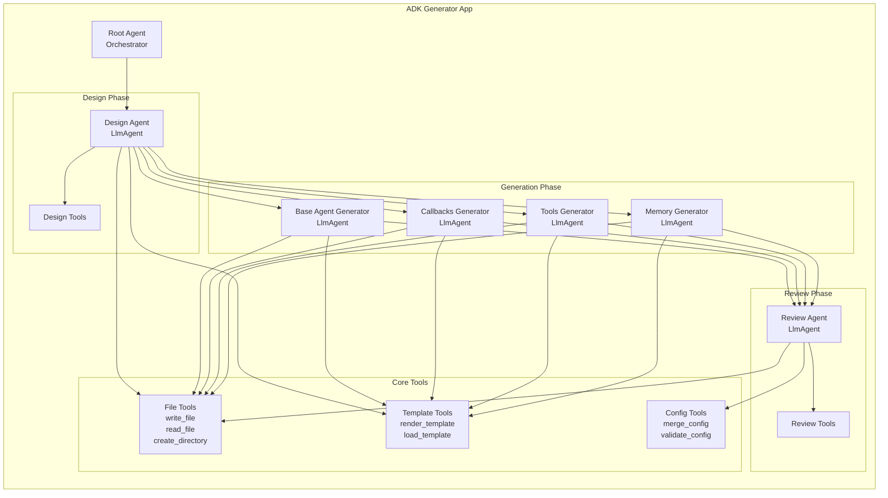
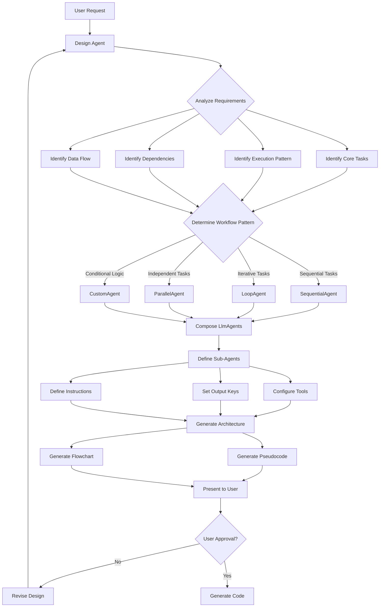
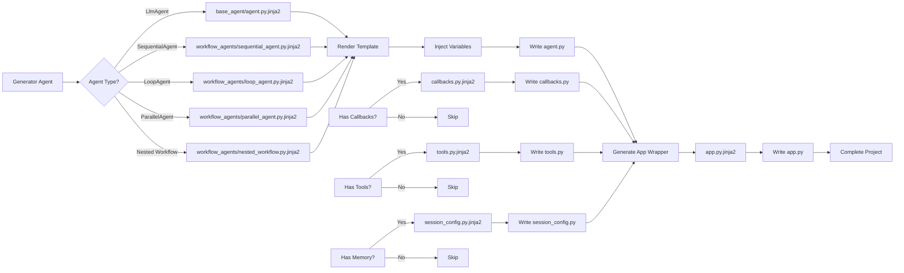
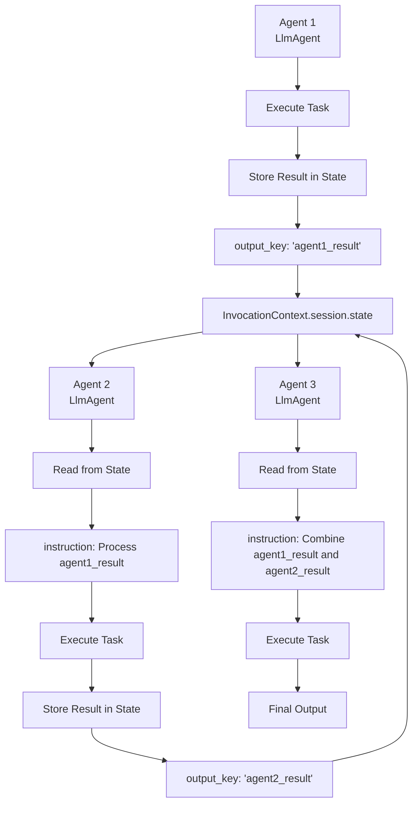
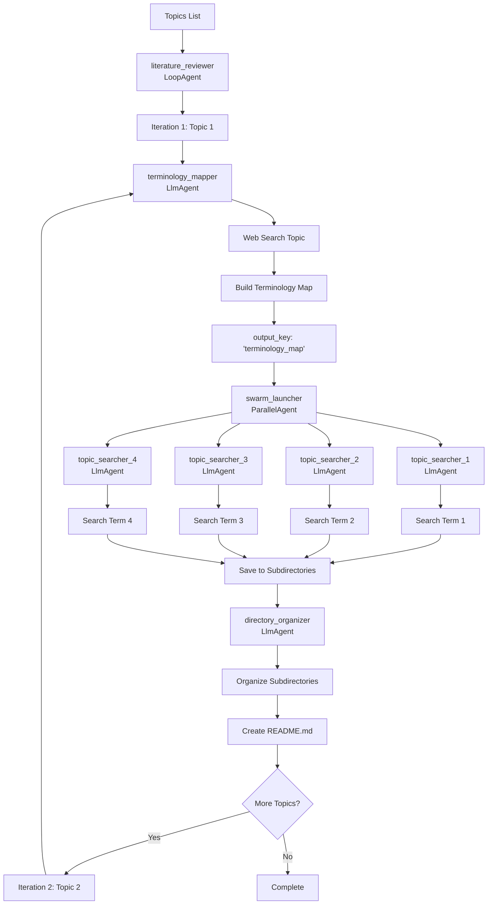
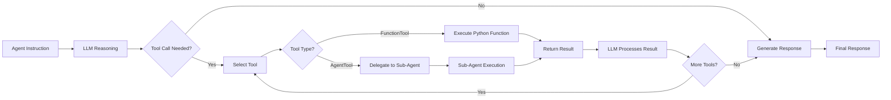

# ADK Generator - System Architecture Flowchart

## High-Level Workflow

## Detailed Agent Architecture

## Workflow Agent Interpretation Flow

## Template Rendering Flow

## State Management Flow

## Example: Literature Review System Architecture

## Tool Execution Flow

