# RLM Workflow Flow Report

**Session ID:** `test_level_16_1769446985`
**Invocation ID:** `e-dba58506-d9a5-4678-9bb0-5f240bfd771b`
**Generated:** 2026-01-26T13:27:18.089626

## Summary

| Metric | Value |
|--------|-------|
| Duration | 1537.7s |
| Total Events | 48 |
| LLM Calls | 14 |
| Tool Calls | 7 |
| Errors | 0 |
| Prompt Tokens | 201,921 |
| Completion Tokens | 9,603 |
| Iterations | 3 |
| Final Status | completed |

**Agents:** databricks_analyst, job_builder, results_processor, user

**Tools Used:** exit_loop, get_repo_file, repo_filename_search, save_artifact_to_volumes

**Artifacts:** art_7e85aec657c7, art_2bd59ecd6346, art_60ce2f7443de

## Workflow Flowchart

```mermaid
flowchart TD
    %% Style definitions
    classDef agent fill:#e1f5fe,stroke:#01579b
    classDef tool fill:#fff3e0,stroke:#e65100
    classDef transfer fill:#f3e5f5,stroke:#7b1fa2
    classDef error fill:#ffebee,stroke:#c62828
    classDef artifact fill:#e8f5e9,stroke:#2e7d32

    N1["user: unknown"]:::agent
    N2["🔧 repo_filename_search"]:::tool
    N1 -->|6008t| N2
    N3["✓ repo_filename_search"]:::tool
    N2 -->|6008t| N3
    N4["🔧 repo_filename_search"]:::tool
    N3 -->|6008t| N4
    N5["✓ repo_filename_search"]:::tool
    N4 -->|6008t| N5
    N6["databricks_analyst: unknown"]:::agent
    N5 -->|6008t| N6
    N7["databricks_analyst: unknown"]:::agent
    N6 -->|6008t| N7
    N8["💬 job_builder"]:::agent
    N7 --> N8
    N9["job_builder: unknown"]:::agent
    N8 --> N9
    N10["💬 job_builder"]:::agent
    N9 --> N10
    N11["results_processor: unknown"]:::agent
    N10 --> N11
    N12["🔧 repo_filename_search"]:::tool
    N11 -->|6008t| N12
    N13["✓ repo_filename_search"]:::tool
    N12 -->|6008t| N13
    N14["databricks_analyst: unknown"]:::agent
    N13 -->|6008t| N14
    N15["➡️ job_builder"]:::transfer
    N14 -->|6008t| N15
    N16["💬 job_builder"]:::agent
    N15 --> N16
    N17["job_builder: unknown"]:::agent
    N16 --> N17
    N18["💬 job_builder"]:::agent
    N17 --> N18
    N19["results_processor: unknown"]:::agent
    N18 --> N19
    N20["🔧 repo_filename_search"]:::tool
    N19 -->|6008t| N20
    N21["databricks_analyst: unknown"]:::agent
    N20 -->|6008t| N21
    N22["🔧 get_repo_file"]:::tool
    N21 -->|6008t| N22
    N23["✓ get_repo_file"]:::tool
    N22 -->|6008t| N23
    N24["databricks_analyst: unknown"]:::agent
    N23 -->|6008t| N24
    N25["➡️ job_builder"]:::transfer
    N24 -->|6008t| N25
    N26["💬 job_builder"]:::agent
    N25 --> N26
    N27["job_builder: unknown"]:::agent
    N26 --> N27
    N28["💬 job_builder"]:::agent
    N27 --> N28
    N29["results_processor: unknown"]:::agent
    N28 --> N29
    N30["🔧 get_repo_file"]:::tool
    N29 -->|6008t| N30
    N31["✓ get_repo_file"]:::tool
    N30 -->|6008t| N31
    N32["databricks_analyst: unknown"]:::agent
    N31 -->|6008t| N32
    N33["➡️ job_builder"]:::transfer
    N32 -->|6008t| N33
    N34["💬 job_builder"]:::agent
    N33 --> N34
    N35["job_builder: unknown"]:::agent
    N34 --> N35
    N36["💬 job_builder"]:::agent
    N35 --> N36
    N37["results_processor: unknown"]:::agent
    N36 --> N37
    N38["databricks_analyst: unknown"]:::agent
    N37 -->|6008t| N38
    N39["databricks_analyst: unknown"]:::agent
    N38 -->|6008t| N39
    N40["💬 job_builder"]:::agent
    N39 --> N40
    N41["job_builder: unknown"]:::agent
    N40 --> N41
    N42["💬 job_builder"]:::agent
    N41 --> N42
    N43["results_processor: unknown"]:::agent
    N42 --> N43
    N44["databricks_analyst: unknown"]:::agent
    N43 -->|6008t| N44
    N45["✓ save_artifact_to_volumes"]:::tool
    N44 -->|6008t| N45
    N46["🔧 exit_loop"]:::tool
    N45 -->|6008t| N46
    N47["🏁 Exit Loop"]:::transfer
    N46 -->|6008t| N47
    N48["databricks_analyst: unknown"]:::agent
    N47 -->|6008t| N48
```

## LLM Call Details

| # | Agent | Model | Prompt Tokens | Completion | Latency | Status |
|---|-------|-------|---------------|------------|---------|--------|
| 1 | databricks_analyst | openai/gpt-5.2 | 6008 | 199 | 9522ms | completed |
| 2 | databricks_analyst | openai/gpt-5.2 | 6821 | 39 | 4302ms | completed |
| 3 | databricks_analyst | openai/gpt-5.2 | 6983 | 2357 | 44662ms | completed |
| 4 | databricks_analyst | openai/gpt-5.2 | 10080 | 72 | 6818ms | completed |
| 5 | databricks_analyst | openai/gpt-5.2 | 10386 | 942 | 22090ms | completed |
| 6 | databricks_analyst | openai/gpt-5.2 | 13291 | 52 | 6384ms | completed |
| 7 | databricks_analyst | openai/gpt-5.2 | 14285 | 98 | 5162ms | completed |
| 8 | databricks_analyst | openai/gpt-5.2 | 14727 | 597 | 17717ms | completed |
| 9 | databricks_analyst | openai/gpt-5.2 | 15990 | 100 | 4076ms | completed |
| 10 | databricks_analyst | openai/gpt-5.2 | 16453 | 1522 | 25681ms | completed |
| 11 | databricks_analyst | openai/gpt-5.2 | 18903 | 1066 | 19516ms | completed |
| 12 | databricks_analyst | openai/gpt-5.2 | 21020 | 2371 | 49621ms | completed |
| 13 | databricks_analyst | openai/gpt-5.2 | 23467 | 13 | 4993ms | completed |
| 14 | databricks_analyst | openai/gpt-5.2 | 23507 | 175 | 7084ms | completed |

## Event Timeline

| Time | Seq | Actor | Kind | Summary |
|------|-----|-------|------|---------|
| 17:03:28.666 | 2000 | user | unknown |  |
| 17:03:47.761 | 3000 | databricks_analyst | tool_call | Called repo_filename_search({'keyword': 'readme\|docs\|conflue... |
| 17:04:52.474 | 4000 | databricks_analyst | tool_response | repo_filename_search returned: success |
| 17:06:50.351 | 5000 | databricks_analyst | tool_call | Called repo_filename_search({'keyword': '%', 'search_field':... |
| 17:07:44.775 | 6000 | databricks_analyst | tool_response | repo_filename_search returned: success |
| 17:07:55.996 | 7000 | databricks_analyst | unknown |  |
| 17:09:02.845 | 8000 | databricks_analyst | unknown |  |
| 17:09:17.867 | 9000 | job_builder | model_message | Submitting executor job 759149471734802 for artifact art_f8d... |
| 17:10:27.651 | 10000 | job_builder | unknown |  |
| 17:10:49.190 | 11000 | job_builder | model_message | Stage is executed, not delegated - skipping job submission. |
| 17:11:14.398 | 12000 | results_processor | unknown |  |
| 17:11:29.907 | 13000 | databricks_analyst | tool_call | Called repo_filename_search({'keyword': 'Master-Vendor-Align... |
| 17:12:31.005 | 14000 | databricks_analyst | tool_response | repo_filename_search returned: success |
| 17:12:43.180 | 15000 | databricks_analyst | unknown |  |
| 17:13:29.837 | 16000 | databricks_analyst | transfer | Transfer to agent: job_builder |
| 17:13:44.133 | 17000 | job_builder | model_message | Submitting executor job 759149471734802 for artifact art_7e8... |
| 17:14:32.957 | 18000 | job_builder | unknown |  |
| 17:14:55.685 | 19000 | job_builder | model_message | Stage is executed, not delegated - skipping job submission. |
| 17:15:15.433 | 20000 | results_processor | unknown |  |
| 17:15:31.160 | 21000 | databricks_analyst | tool_call | Called repo_filename_search({'keyword': 'README.md\|docs\|CONT... |
| 17:16:05.037 | 22000 | databricks_analyst | unknown |  |
| 17:16:18.462 | 23000 | databricks_analyst | tool_call | Called get_repo_file({'filepaths': ['Master-Vendor-Alignment... |
| 17:16:50.279 | 24000 | databricks_analyst | tool_response | get_repo_file returned: error |
| 17:17:02.693 | 25000 | databricks_analyst | unknown |  |
| 17:17:48.411 | 26000 | databricks_analyst | transfer | Transfer to agent: job_builder |
| 17:18:05.893 | 27000 | job_builder | model_message | Submitting executor job 759149471734802 for artifact art_2bd... |
| 17:18:55.117 | 28000 | job_builder | unknown |  |
| 17:19:25.981 | 29000 | job_builder | model_message | Stage is executed, not delegated - skipping job submission. |
| 17:19:45.443 | 30000 | results_processor | unknown |  |
| 17:20:05.016 | 31000 | databricks_analyst | tool_call | Called get_repo_file({'filepaths': ['Master-Vendor-Alignment... |
| 17:20:38.729 | 32000 | databricks_analyst | tool_response | get_repo_file returned: error |
| 17:20:51.359 | 33000 | databricks_analyst | unknown |  |
| 17:21:39.844 | 34000 | databricks_analyst | transfer | Transfer to agent: job_builder |
| 17:21:55.764 | 35000 | job_builder | model_message | Submitting executor job 759149471734802 for artifact art_60c... |
| 17:23:06.588 | 36000 | job_builder | unknown |  |
| 17:23:29.676 | 37000 | job_builder | model_message | Stage is executed, not delegated - skipping job submission. |
| 17:23:50.274 | 38000 | results_processor | unknown |  |
| 17:24:09.092 | 39000 | databricks_analyst | unknown |  |
| 17:24:50.681 | 40000 | databricks_analyst | unknown |  |
| 17:25:06.886 | 41000 | job_builder | model_message | Submitting executor job 759149471734802 for artifact art_994... |
| 17:25:57.063 | 42000 | job_builder | unknown |  |
| 17:26:20.977 | 43000 | job_builder | model_message | Stage is executed, not delegated - skipping job submission. |
| 17:26:42.624 | 44000 | results_processor | unknown |  |
| 17:26:59.933 | 45000 | databricks_analyst | unknown |  |
| 17:28:18.158 | 46000 | databricks_analyst | tool_response | save_artifact_to_volumes returned: success |
| 17:28:29.523 | 47000 | databricks_analyst | tool_call | Called exit_loop({}...) |
| 17:28:52.615 | 48000 | databricks_analyst | escalate | Escalate (exit loop) |
| 17:29:06.401 | 49000 | databricks_analyst | unknown |  |

## State Changes

**17:09:02.845** (databricks_analyst):
  - Set: `rlm:iteration`

**17:13:29.837** (databricks_analyst):
  - Set: `rlm:iteration`

**17:16:05.037** (databricks_analyst):
  - Set: `last_repo_search_count, last_repo_search_rows, last_repo_search_query`

**17:16:50.279** (databricks_analyst):
  - Set: `last_download_directory, last_download_count, last_download_files`

**17:17:48.411** (databricks_analyst):
  - Set: `rlm:iteration`

**17:20:38.729** (databricks_analyst):
  - Set: `last_download_directory, last_download_count, last_download_files`

**17:21:39.844** (databricks_analyst):
  - Set: `rlm:iteration`

**17:24:50.681** (databricks_analyst):
  - Set: `rlm:iteration`
